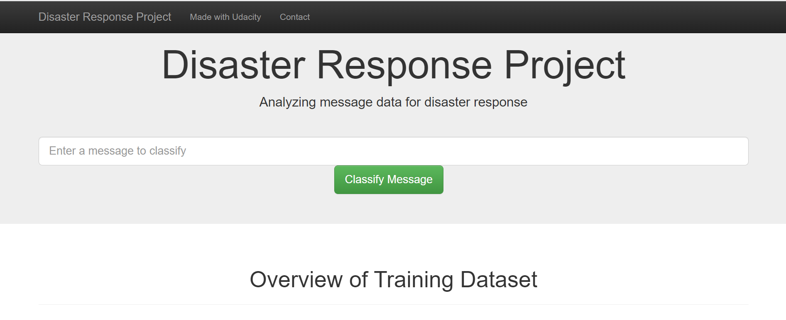

# Disaster Response Pipeline Project

## Table of Contents

1. [Motivation](#motivation)
2. [File description](#file)
3. [Results](#results)
4. [Instructions](#instructions)
5. [Acknowledgements](#acknowledgements)

## Motivation 

The aim of the project was divided into 3 sections:
1. creating an ETL script that takes two CSV files, merges and cleans them, and stores the result in a SQLite database.
2. creating a Python script that takes the data from the database and creates a machine learning pipeline that processes 
text and then performs multi-output classification. The script uses a tokenize function to tokenise, normalise 
and lemmatise text using NLTK.
3. deploying the trained model in a Flask web app that classifies user input for 36 different categories.

## File description 

The data used for this supervised learning project were a dataset of disaster reporting data 
(disaster_messages.csv) and the corresponding category data (disaster_categories.csv). The datasets were provided by 
[Figure Eight](https://appen.com/).

- ETL Pipeline Preparation.ipynb: Jupyter notebook to create the ETL script and get an overview of the data.
  - data/process_data.py: Python script created with the above preparation to create the pipeline.

- ML Pipeline Preparation.ipynb: Jupyter notebook to prepare the machine learning pipeline, create the tokenize function 
and optimisation of the model.
  - models/train_classifier.py: Python script to create the machine learning pipeline.
  - models/classifier.pkl: Pickle file containing the model trained in the above pipeline.

## Results 

As already mentioned, the result of this project is a web app that can be used to classify a new message into different categories in an emergency. 
can be classified into different categories.

Potential for improvement: Although the ML pipeline uses GridSearchCV to optimise classification, there is still 
much room for improvement:
- Testing different estimators to optimise classification (RandomForestClassifier() was used in this project).
- Setting an extended list of parameters for GridSearchCV to optimise the model.
- Using FeatureUnion to extend the pipeline for better results

Screenshot of the Disaster Response Pipeline

## Instructions 

This instruction were originally made by the team at [Udacity's](https://www.udacity.com/).
1. Run the following commands in the project's root directory to set up your database and model.

    - To run ETL pipeline that cleans data and stores in database
        `python data/process_data.py data/disaster_messages.csv data/disaster_categories.csv data/DisasterResponse.db`
    - To run ML pipeline that trains classifier and saves
        `python models/train_classifier.py data/DisasterResponse.db models/classifier.pkl`

2. Run the following command in the app's directory to run your web app.
    `python run.py`

3. Go to http://0.0.0.0:3001/

## Acknowledgments 

I would like to thank the team from [Udacity's](https://www.udacity.com/) for the great support and the brilliant online 
course [Data Scientist Nanodegree](https://www.udacity.com/course/data-scientist-nanodegree--nd025).